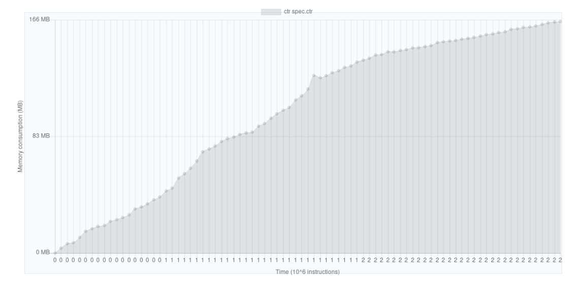

# NLP Project #4
## Stopword Detection
-- by Ali Mohammad Pur Fard

### Top-level Explanation
0. The documents are first tokenised normally
1. The TF sparse matrix, and the DF vector is generated for all the word-types (see notes#1 about this)
2. Each word-type is evaluated with the (below) given `score` function
3. The top 300 words in order of RSD are picked as stopwords (somewhat arbitrary)

### Evaluation Measure
The `score` function is defined as such
$$
  score_{(x)} = \mathcal{CV}_x = {{\sigma_x} \over {\bar x}}
$$
and it is applied to the DF|TF matrix in such a manner:
$$
  scoredVector(DF|TF) = {\sum\limits_{rows of TF}score({DF \cdot i})}
$$
with $scoredVector$ being the resulting evaluated vector

It is quite apparent that neither the TF matrix, nor the DF vector are normalised.
This is simply due to the fact that our chosen evaluation method works on absolute units
(quite simple, it is self-normalising anyway)

### Pros and Cons of this evaluation method

#### Pros
1. no prior normalisation is necessary
2. can be calculated in exactly one pass over each vector (see `TokenAnalyser::'calculateRSD:withMap:andDFVector:pre:post:'`)

#### Cons
1. when a word-type's TF matrix is really sparse, tends to generate very big results (>1000% RSD%)

### Notes

1. Since we can't create full association maps with sparse matrices, we have to store the index to a given token in a hashtable,
which causes rather severe slowdowns (mainly a language issue), this is a non-issue in say, Python, whose `dict` is optimised for fast lookups. [see access time stats in the Stats section].

2. GSL is used for Sparse Matrices, which has a rather lackluster view implementation, as such, RSD calculation is not as fast as it could be.

### Stats

1. average HashMap access time for hits and misses (all times in us):

| Predicate      | Min            | 1st Qu.        | Median         | Mean           | 3rd Qu.        | Max            |
| :------------- | :------------- | :------------- | :------------- | :------------- | :------------- | :------------- |
| Hit (1244696)  | 0.00           | 3.00           | 4.00           | 6.04           | 5.00           | 205007.00      |
| Miss (44123)   | 0.00           | 3.00           | 4.00           | 4.60           | 5.00           | 66.00          |

2. Memory Statistics for 600 documents

